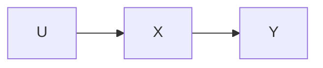
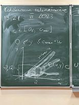
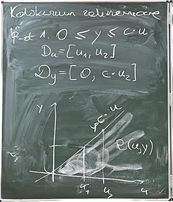

# ZA, ZD, ZDP dla relacyjnej RW

## 
2. Relacyjna reprezentacja wiedzy $R(u,y)$

$$ R(u,y) = \{ (u, y) \in U \times Y; u \rho y\} $$

$\rho = własność$

$D_y(u)$ = zbiór wszystkich y, dla których istnieje u

Przyczyny poslugiwanaia sie modelem relacyjnym:
1. Znana (deterministyczna) zależnność funkcyjna, ale nie znany parametr $c$ (Z punktu widzenia tego opisu każdy efekt jest jednakowo możliwy).
2. Obiekt jest z natury niedeterministyczny
3. Obiekt jest deterministyczny, ale nie znamy modelu,
parametrów modelu. Chcemy działąnie obiektu przybliżać prostym modelem relacyjnym

$u \in D_u$ - wspolna własnosc wejsciowa
$y \in D_y$ - wspolna własnosc wyjscoiwa

$D_u \subset U, D_y \subset Y $ - zbiory  wejść i wyjsć do d

 

## Za dla RRW

Dane: 
> $D_u, R$

Szukane:
>Najmniejszy zbiór $D_y$ spełniający (1)

Przydatny wzór do wyznaczenia $D_y$:
$$ D_y = \cup_{u \in D_u} D_y(u) $$

1. Przykład 

  > $y \le c * u$ 
  > $D_u = [u_1, u_2]$ 
  >$D_y = [0, c * u_2]$ 

## 4. Zadanie diagnostyki - ZD dla RRN

mniejszy zbiór $D_y$ spełniający (1)

$$ (y \in D_y) \wedge (u, y) \in R \rightarrow (u \in D_u)$$

Przykładowy wzór:
$$ D_y = u \in U: D_y(u) \land D_y(u) \not = \emptyset $$

1. Przykład 

  > $y \le c * u$ 
  > $D_u = [y_1, y_2]$ 
  >$D_y = [u_{min}, \infty]$ 

## ZPD dla RRW
Dane: 
> $D_u, R$

Szukane:
>Największy zbiór $D_u$ spełniający (1)